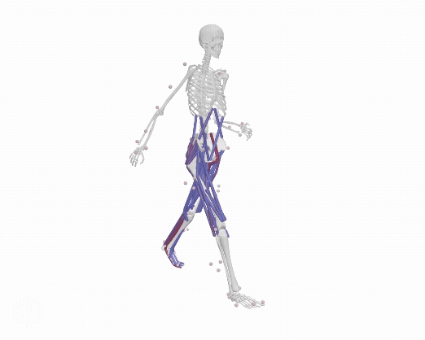

# Tutorial: 3D Predictive Simulations of Amputee Walking

This tutorial adapts the predictive simulation framework developed by [Antoine Falisse](https://github.com/antoinefalisse/predsim_tutorial) to better represent the physical characteristics and control strategies of individuals with transtibial amputation. The simulation framework leverages [OpenSimAD](https://github.com/christopherllong/opensimAD_comVelocity). OpenSimAD is a custom version of OpenSim that supports algorithmic differentiation. 

The generated predictive simulations should look like this:

  

# Setup conda environment
1. Install [Anaconda](https://www.anaconda.com/)
2. Open Anaconda prompt
3. Create environment (python 3.9 recommended): `conda create -n predsim_tutorial_amputee python=3.9`
4. Activate environment: `conda activate predsim_tutorial_amputee`
5. Install OpenSim (assuming python 3.9): `conda install -c opensim-org opensim=4.4=py39np120`
	- (Optional) Test that OpenSim was successfully installed:
		- Start python: `python`
		- Import OpenSim: `import opensim`
			- If you don't get any error message at this point, you should be good to go.
		- You can also double check which version you installed : `opensim.GetVersion()`
		- Exit python: `quit()`
		- Visit this [webpage](https://simtk-confluence.stanford.edu:8443/display/OpenSim/Conda+Package) for more details about the OpenSim conda package.
6. Clone the repository to your machine: 
	- Navigate to the directory where you want to download the code: eg, `cd ./Documents`
	- Clone the repository: `git clone https://github.com/christopherllong/predsim_tutorial_amputee.git`
	- Navigate to the directory: `cd ./predsim_tutorial_amputee`
7. Install required packages: `python -m pip install -r requirements.txt`
8. (Optional): Install an IDE such as Spyder: `conda install spyder`

# Tutorial
## Part 1: Generate external function
(You can skip to part 2 if you are only interested in the simulation part, the outputs from part 1 are already available).

To leverage the benefits of algorithmic differentiation, we use [CasADi external functions](https://web.casadi.org/docs/#casadi-s-external-function). In our case, the external functions take as inputs the multi-body model states (joint coordinate values and speeds) and controls (joint coordinate accelerations) and return, among other things, the resulting joint torques. **We have modified the original script to include mediolateral center-of-mass velocity as an output from the external function**. To generate an external function, we need an OpenSim model and [OpenSimAD](https://github.com/christopherllong/opensimAD_comVelocity). In this tutorial, the OpenSim model we will use is a scaled version of the Hamner model with ankle muscles removed. Assuming you used the folder structure above, you can find it in: [/Documents/predsim_tutorial_amputee/OpenSimModel/Hamner_modified_amp/Model/Hamner_modified_amp_scaled.osim](https://github.com/christopherllong/predsim_tutorial_amputee/blob/main/OpenSimModel/Hamner_modified_amp/Model/Hamner_modified_amp_scaled.osim). Let's generate the external function corresponding to this model.

1. Download the [OpenSimAD](https://github.com/christopherllong/opensimAD_comVelocity) repository and install the [third party packages](https://github.com/christopherllong/opensimAD_comVelocity#install-requirements) (if applicable). You do NOT need to set up the opensim-ad conda environment; the environment you created above (predsim_tutorial_amputee) contains all you need. We will assume you downloaded the repository under /Documents/opensimAD_comVelocity.

2. In /Documents/opensimAD_comVelocity/main.py, adjust:
    - [`pathModelFolder`](https://github.com/christopherllong/opensimAD_comVelocity/blob/main/main.py#L44) to the path of the folder containing the model, eg `pathModelFolder = '/Documents/predsim_tutorial_amputee/OpenSimModel/Hamner_modified_amp/Model'`.
	- [`modelName`](https://github.com/christopherllong/opensimAD_comVelocity/blob/main/main.py#L46) to the name of the model: `modelName = 'Hamner_modified_amp_scaled'`.
	
3. Activate the predsim_tutorial_amputee conda environment if not already done: `conda activate predsim_tutorial_amputee`

4. Run `main.py` (the one from the [OpenSimAD](https://github.com/christopherllong/opensimAD_comVelocity) repository). You should see some new files in /Documents/predsim_tutorial_amputee/OpenSimModel/Hamner_modified_amp/Model. Among them, the following three files: `Hamner_modified_amp_scaled.cpp`, `Hamner_modified_amp_scaled.npy`, and `Hamner_modified_amp_scaled.dll` (Windows) or `Hamner_modified_amp_scaled.so` (Linux) or `Hamner_modified_amp_scaled.dylib` (macOS). The .cpp file contains the source code of the external function, the .dll/.so/.dylib file is the dynamically linked library that can be called when formulating your trajectory optimization problem, the .npy file is a dictionary that describes the outputs of the external function (names and indices).

5. Modify the .cpp file to add a passive torque actuator at the ankle joint to model a passive prosthesis.

6. Recompile the dynamically linked library (.dll file).

## Part 2: Generate simulations
In this part, we will generate the predictive simulations. We use direct collocation methods for formulating the underlying optimal control problem (you can find more details about these methods in the publications below). In the first example, we simulate a transtibial amputee walking using the original multi-objective cost function used by [Falisse et al. 2019](https://royalsocietypublishing.org/rsif/article/16/157/20190402/87166/Rapid-predictive-simulations-with-complex). In the last three examples, we introduce a new [cost term](https://github.com/christopherllong/predsim_tutorial_amputee/blob/e980ec02a76625c7ba5b5b4d335ba7086f5ddbf9/main_comVelocity.py#L1062) to minimize the squared mediolateral center-of-mass velocity. For all examples, we simulate for half a gait cycle, impose left-right symmetricity, and reconstruct a full gait cycle post-optimization. Let's first generate the simulations with the amputee model for which we generated the external function in part 1 (if you skipped part 1, no worries the required files were pre-generated).

1. **Set settings.** In `settings.py`, we will set some settings for the simulations (this is already done). We will run the case '0' to start with ([key '0' in the settings dictionary](https://github.com/christopherllong/predsim_tutorial_amputee/blob/main/settings.py#L5)). We want to use the model 'Hamner_modified_amp' (which is the one for which we generated the external function in part 1). Other settings are the target speed, let's set it to 1.33m/s, and the number of mesh intervals, let's use 25 mesh intervals. FYI since we use a third-order collocation scheme, the dynamic equations are enforced at three collocation points within each interval. With 25 mesh intervals, this means we have 75 collocation points. Assuming half a gait cycle is about 0.55s, we therefore enforce the dynamic constraints about every 7ms.

2. **Run simulation.** In `main_comVelocity.py`, let's run the case '0'. You can select which case to run by adjusting the [list cases](https://github.com/christopherllong/predsim_tutorial_amputee/blob/main/main_comVelocity.py#L40). By default, it runs case '0'.
	- Run `main_comVelocity.py` either in the terminal (`python main_comVelocity.py` or in your favorite IDE).
	- The first time you run `main_comVelocity.py` with a new model, the script will approximate polynomial expressions to estimate muscle-tendon lengths, velocities, and moment arms from joint coordinate values and speeds. It will also save the model body mass and the muscle-tendon parameters as .npy files (see the few files that appeared in the Model folder). After the polynomial fitting, you should see the Ipopt outputs on your console. That means the optimization has started. If it succesfully converges, you should see "EXIT: Optimal Solution Found" after a little while (should be less than 30 minutes, although it depends on your machine).

3. **Visualize the results.** In the results folder, you should now see a new folder named case_0. This folder contains the results. The motion.mot file contains the optimal joint coordinate values and muscle activations, the GRF.mot file contains the optimal resultant ground reaction forces, the stats.npy file contains some CasADi statistics about the solved optimization problem, and the w_opt.npy file contains the optimized design variables. Under /Documents/predsim_tutorial_amputee/Results, you should also see a file named optimaltrajectories.npy, this file contains more results from the optimization (eg, metabolic cost of transport).
	- To visualize the optimal motion, you can use the OpenSim GUI (more details below). Open the model (Hamner_modified_amp_scaled.osim), load the motion file (motion.mot), and associate the GRF data (GRF.mot). You should see something similar to the gif in this README.
		
### You have generated a baseline simulation of transtibial amputee gait, congrats! **Note that the model adopts a hip circumduction gait to account for missing ankle muscles.** Now let's introduce a center-of-mass (COM) velocity cost term with varying weights and compare the predicted joint kinematics to experimental data.

1. **Change the COM Velocity Cost Term Weight -> 1000.** In `settings.py`, create a new case '1' and change the COM velocity weight (this is already done). Now run `main_comVelocity.py` after making sure you will be running case '1'. 

2. **Change the COM Velocity Cost Term Weight -> 50000.** In `settings.py`, create a new case '2' and change the COM velocity weight (this is already done). Now run `main_comVelocity.py` after making sure you will be running case '2'. 

3. **Change the COM Velocity Cost Term Weight -> 1000000.** In `settings.py`, create a new case '3' and change the COM velocity weight (this is already done). Now run `main_comVelocity.py` after making sure you will be running case '3'. 

# Visualize simulations in OpenSim
1. Launch OpenSim GUI
2. Open model, eg `OpenSimModel/Hamner_modified/Model/Hamner_modified_amp_scaled.osim`
3. Load motion, eg `Results/Case_0/motion.mot`
4. Associate Motion Data, eg `Results/Case_0/GRF.mot`

## Part 3: Compare simulated joint kinematics to experimental data

# Warning
We made some assumptions for the examples of this tutorial. Make sure you verify what you are doing if you end up using this code beyond the provided examples. Also, please remember that generating walking simulations involves solving large optimization problems. It is highly possible that your problems converge to local minima. You should always do some sensitivity analyses to make sure that your solutions make sense (eg, does your solution change if you increase the number of mesh intervals or use a different initial guess).

# Citation
This work is covered in three publications. Please consider citing these papers:
1. Study about supporting algorithmic differentation in OpenSim:
	- Falisse A, Serrancolí G, et al. (2019) Algorithmic differentiation improves the computational efficiency of OpenSim-based trajectory optimization of human movement. PLoS ONE 14(10): e0217730. https://doi.org/10.1371/journal.pone.0217730
2. Study about using predictive simulations to investigate different cost functions:
	- Falisse A, et al. (2019) Rapid predictive simulations with complex musculoskeletal models suggest that diverse healthy and pathological human gaits can emerge from similar control strategies. J. R. Soc. Interface.162019040220190402. http://doi.org/10.1098/rsif.2019.0402
3. Study about using predictive simulations to investigate the effect of mechanical assumptions:
	- Falisse A, Afschrift M, De Groote F (2022) _Modeling toes contributes to realistic stance knee mechanics in three-dimensional predictive simulations of walking. PLoS ONE 17(1): e0256311. https://doi.org/10.1371/journal.pone.0256311
